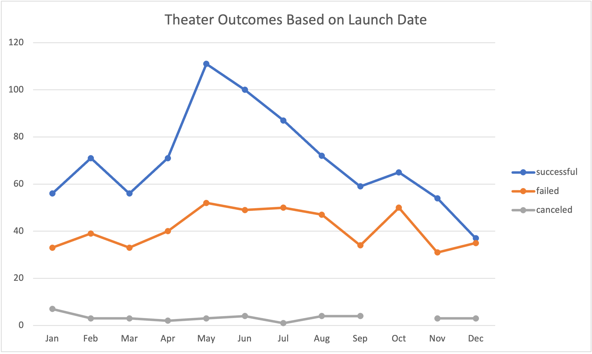

# Kickstarting with Excel

## Overview of Project
This project was used to analyze data in excel to paint the best possible photo for Louise on how to proceed with her fundraising goal for her theater play *Fever*. The data that was analyzed was used to compare the different fundraising goals and launch dates of a variety of different plays and other theater acts. This data was then used to best inform Louise on how to begin with her fundraising of the play.

### Purpose
The purpose of this project was to aid Louise on how to proceed with the funding of her play *Fever* . Louise was was seeking information on how her play's proposed fundraising goal compared to the fundraising goals of other plays. Data that was provided showed the proposed fundraising goals of a variety of different kickstarters, including theaters and plays. 
Some of the information that is being presented to Louise shows the difference between the goals of different theater kickstarters, and their success rate, as well as the success outcome of each different theater kickstarter based off of its launch date. The information acquired from the data is being presented to Louise to best inform her on how to proceed with her play's fundraising, as well as the likelihood of success based on her fundraising goal, and launch date.

## Analysis and Challenges

### Analysis of Outcomes Based on Launch Date
Based on the analysis of the different theater kickstarters and their outcomes from 2009 to 2017, it would be recommended that Louise launch her kickstarter close to the summer months, April through July. As can be seen with , There is a sudden increase in the amount of successful theater kickstarters from April to May, with over 80% of these kickstarters being successful through July. The summer months overall saw a greater amount of kickstarters launched, with an increase of around 50 kickstarters launched in May then the previous two months. This increase in kickstarters also saw an increase of roughly 40 successful kickstarters, and a slight increase in failed kickstarters, of only 12 more failed kickstarters than the previous month.

### Analysis of Outcomes Based on Goals
Louise has a fundraising goal of $10000. According to out chart of , kickstarters that had a fundraising goal between $10000 to $14999 were 55% successful. As can be seen in the chart, the lower the fundraising goal, the more likely it is to be successful, with those kickstarters who had a goal of less than $1000 being 76% successful, and those with goals of $1000 to $4999 being 73% successful. It would be recommended that Louise attempt to not raise her fundraising goal by much more, considering that fundraising goals of $20000 drop quickly in success rate. 

### Challenges and Difficulties Encountered
I did not encounter many challenges/difficulties while doing this challenge. This part of the bootcamp was a good way to start off, being a good refresher on what I knew already. One difficulty I could foresee for some would potentially be some of the formulas used to may be a bit tricky if unfamiliar with it. 

Some potential challenges however, that could come as a result of the data in the scenario, and could potentially skew the decision is that there are several years in which not all months had kickstarters launched for the outcomes by launch date.  This challenge could potentially affect and skew the data, painting an incorrect picture of what months tend to be more successful then others.
There is a similar problem in the chart of outcomes based by goals. There is a clear downward trend from the beginning of the chart of outcomes with a goal of less than 1000, up until the 25000-2999 region. Here there is a random uptick of nearly 40%. When looking a bit further,  the sample size that was used for the first few goals was significantly larger, then the sample size for the goals with larger fundraising goals. For example, the total projects used in the goals of 5000-9999 was 534. However, the sample size for 40000-45999 was only 3 projects
## Results

- What are two conclusions you can draw about the Outcomes based on Launch Date?
	- Two conclusions that can be drawn about the outcomes based on the launch data are that the months between May and July tend to have the most successful launches, with over 80% of all kickstarters being successful during these three months. The second conclusion that can be drawn from the theater outcomes baed on launch data is that overall, theater kickstarters tend to see more success than failure. 

- What can you conclude about the Outcomes based on Goals?
	-When it comes to outcomes based on goals, the lower the fundraising goal is, the higher chance it has of being successful, with over 70% of kickstarters that have less than $4999 fundraising goal being successful. As the fundraising goal increases, there is a steady decline in the success rate. 

- What are some limitations of this dataset?
	-One limitation that stood out to me was the sample size for the different goal amounts when it came to outcomes based on goal. Ideally, one would like to see the sample size for each amount to be similar, and not differ so drastically. There are only three goal amounts that have over 100 total projects, while there are four projects in the data that have less than ten. This skews the overall data, and while the chart shows that there is an increase of about 30% in successful outcomes around the 30000-34999 range, when one looks at the total number of projects for those goals, they would see that there is only six total projects that make number. 

This same problem occurs in the outcomes by launch date for theaters. When one looks at the data that makes up the chart, they would see that there are some months in different years that have no projects launched in certain months.

- What are some other possible tables and/or graphs that we could create?	

	-A table that I believe could be important to get a better understanding on successful kickstarters would be see how many backers each kickstarter has, as well as what the average donation each backer is donating to the kickstarter. This could help Louise make better informed decisions on how to proceed when it comes to setting her fundraising goal, and seeing roughly how many backers she would need, to reach her goal.
